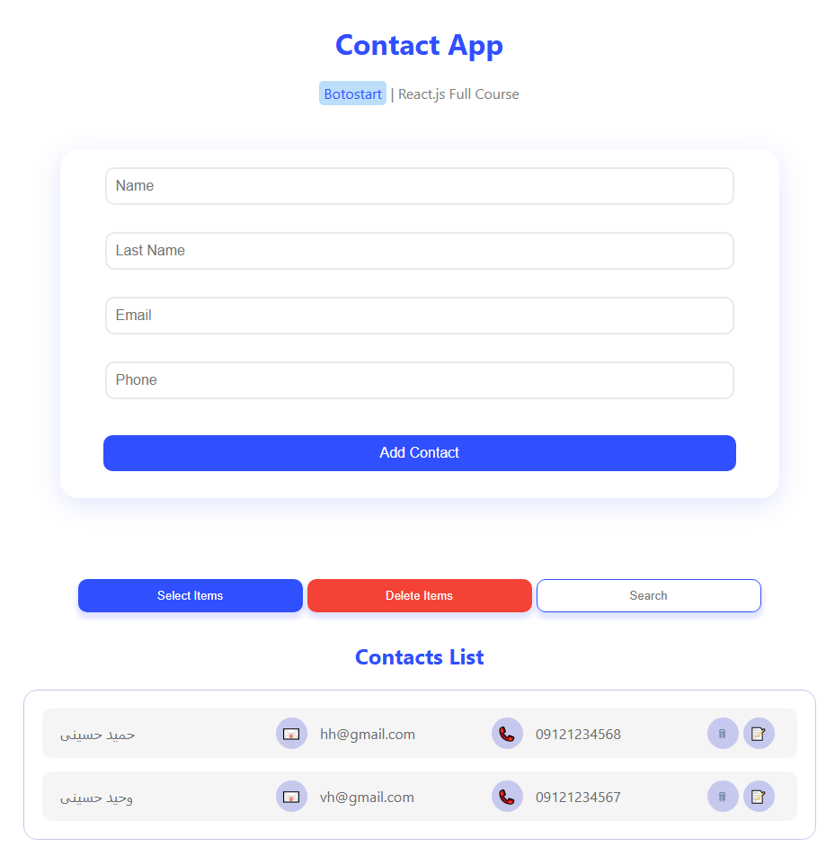

# Contact App

Simple React project built with Vite to manage contacts.

## Features

- Add, edit, and delete contacts
- Responsive design
- State management with React hooks
- Data persistence using JSON Server

## Setup

1. Clone the repo
2. Run `npm install`
3. Run JSON Server with `npm run json-server` (default port: 3001)
4. Run `npm run dev` to start the React development server (default port: 3000)

## Technologies

- React
- Vite
- CSS
- JSON Server

## Notes

- The JSON Server API runs on port 3001
- The React frontend runs on port 3000
- There is a separate branch dedicated to saving contacts in localStorage alongside the API

## Screenshot

## Author

Made by VHD (Vahid Hosseini Developer)
